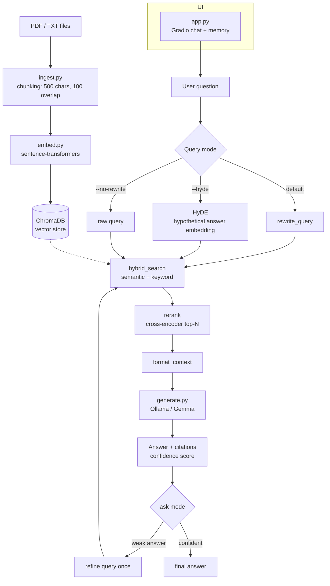

# Local RAG Pipeline

Ask questions to your PDFs and text files. Runs 100% on your machine — no external API keys required.

## Architecture



## Features

- **Hybrid search** — combines semantic vector search with keyword matching so both paraphrased and exact-term questions find the right chunks.
- **HyDE (Hypothetical Document Embeddings)** — `--hyde` generates a hypothetical answer first and searches with that, improving recall when questions don't share vocabulary with the documents.
- **Cross-encoder reranking** — retrieves 2x candidates via hybrid search, then reranks them with a cross-encoder to keep only the best chunks in context.
- **Query rewriting** — rewrites the user question into a search-friendly form before retrieval (toggle off with `--no-rewrite`).
- **Compare mode** — finds agreements and disagreements across documents and synthesizes a single answer.
- **Agentic `ask` mode** — answers, self-checks confidence, and refines the query once if the first pass is weak.
- **Citations & confidence** — every answer cites its sources and reports a calibrated confidence label.
- **Streaming chat UI** — Gradio interface with short conversation memory and advanced toggles for rewrite/rerank.
- **Built-in evaluation** — scores retrieval hits, keyword overlap, LLM-judged faithfulness/relevance, and citation coverage.
- **Fully local** — embeddings, retrieval, reranking, and generation all run on your machine.

## Setup

```bash
python -m venv .venv
.venv\Scripts\activate
pip install -r requirements.txt
ollama pull gemma4:31b-cloud
```

## Usage

```bash
python main.py ingest --file data/sample.txt
python main.py query "what is RAG?"
python main.py query "what are benefits?" --show-chunks
python main.py query "what are benefits?" --no-rewrite
python main.py query "what are benefits?" --hyde
python main.py compare "how do the documents describe x?"
python main.py ask "what is RAG?"
python main.py status
python main.py clear
python main.py export "what is RAG?" --output out.json
```

`query` uses hybrid search (semantic + keyword), a query rewrite, and a cross-encoder rerank by default. Pass `--no-rewrite` to skip the rewrite, `--hyde` to search with a hypothetical answer instead, or `--no-rerank` to skip the reranker.

### Chat UI

```bash
python app.py
```

Streams answers, keeps a short memory of the conversation, and has an advanced toggle to turn the rewrite and rerank on or off. The memory resets when you press clear.

## Evaluation

```bash
python evaluate.py
python evaluate.py --pipeline --limit 3
python evaluate.py --pipeline --output eval/report.json
```

`evaluate.py` reads the questions in `eval/questions.json`, runs each one through the pipeline, and scores:

| Metric | Description |
| --- | --- |
| Retrieval hit | Expected source document was retrieved |
| Keyword overlap | Fraction of expected keywords present in the answer |
| Faithfulness | LLM judge: does the answer stay true to the context (0–1) |
| Relevance | LLM judge: does the answer address the question (0–1) |
| Citation coverage | Fraction of cited sources verified against retrieved chunks |

<!-- RESULTS_PLACEHOLDER: fill after running evaluate.py -->

| Metric | Value |
| --- | --- |
| Questions run | _TBD_ |
| Pass rate (overlap >= 0.5) | _TBD_ |
| Avg keyword overlap | _TBD_ |
| Avg faithfulness | _TBD_ |
| Avg relevance | _TBD_ |
| Retrieval hit rate | _TBD_ |
| Avg citation coverage | _TBD_ |

## Project Structure

- `ingest.py` — reads pdf/txt, splits into chunks
- `embed.py` — vector store wrapper around chromadb
- `retrieve.py` — search, hybrid search, confidence and citation helpers
- `generate.py` — ollama api calls, streaming, reranking
- `pipeline.py` — wires rewrite/hyde + hybrid search + rerank together
- `synthesis.py` — agreement/contradiction checks for compare mode
- `memory.py` — short conversation memory for the ui
- `app.py` — gradio chat ui
- `evaluate.py` — runs the questions in eval/questions.json and scores them
- `main.py` — cli

## Notes

- Only text-based pdfs work; scanned ones need OCR first
- Chunk size is 500 chars with 100 char overlap — change in `ingest.py`
- Change model in `generate.py` (`MODEL = "..."`)
- Needs ~4–6 GB VRAM for 9B models
- Reranking downloads a small cross-encoder model on first use
